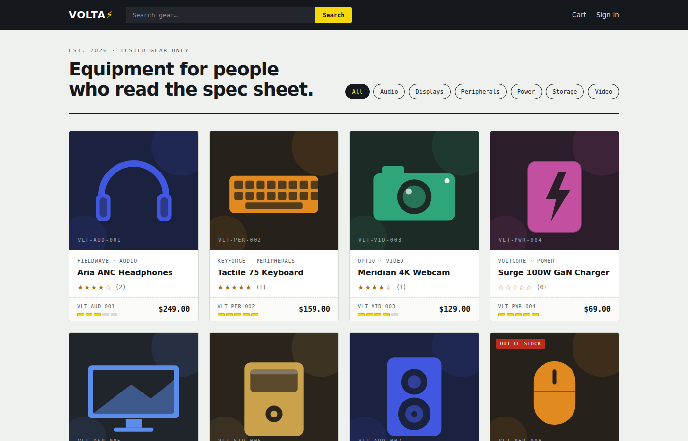
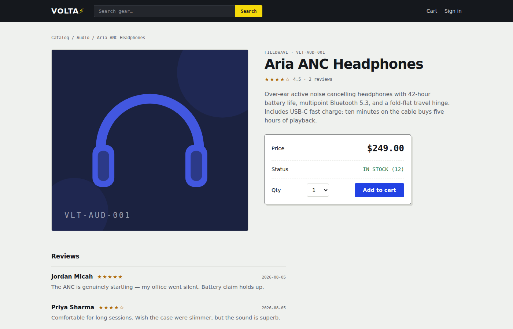
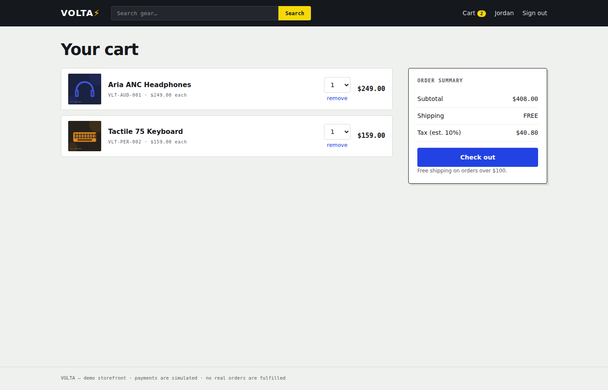
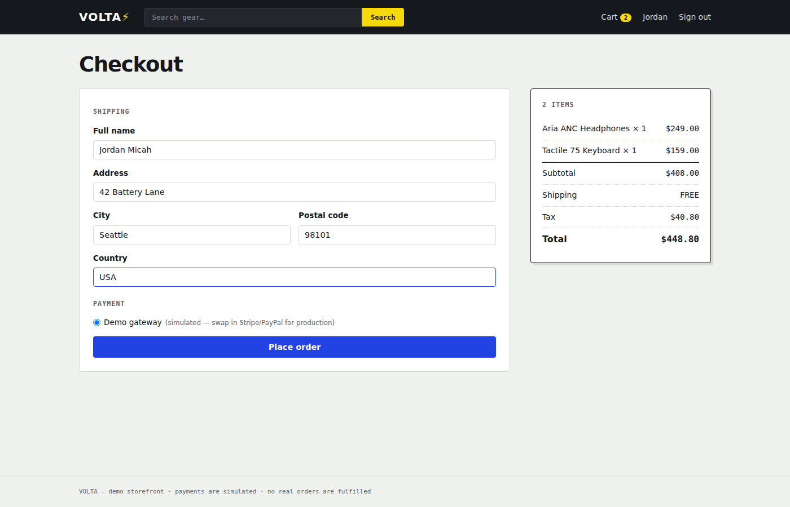
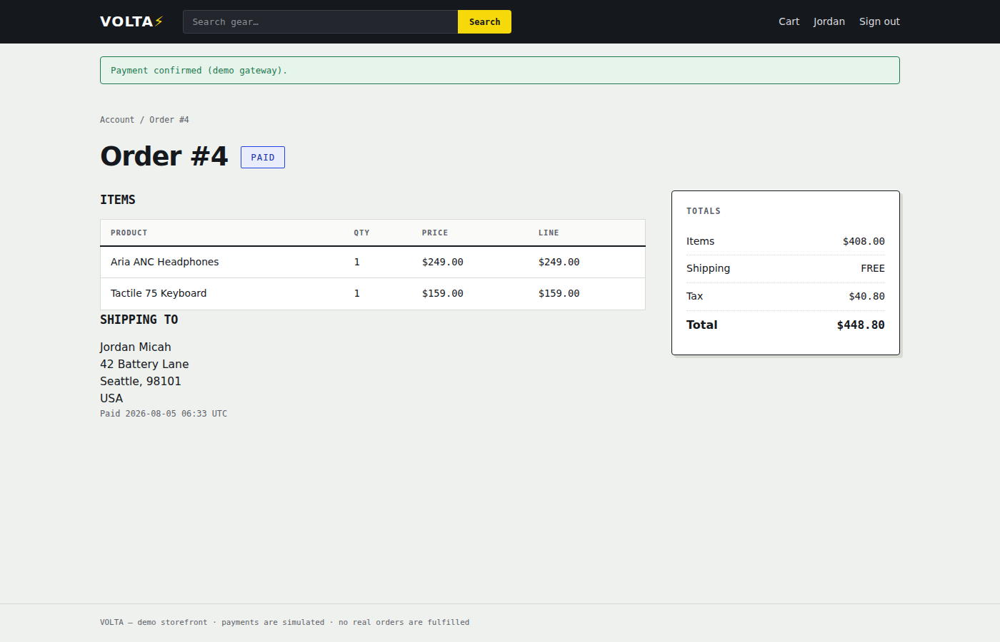
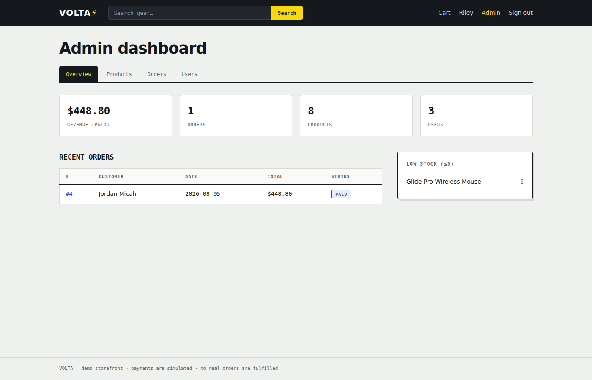
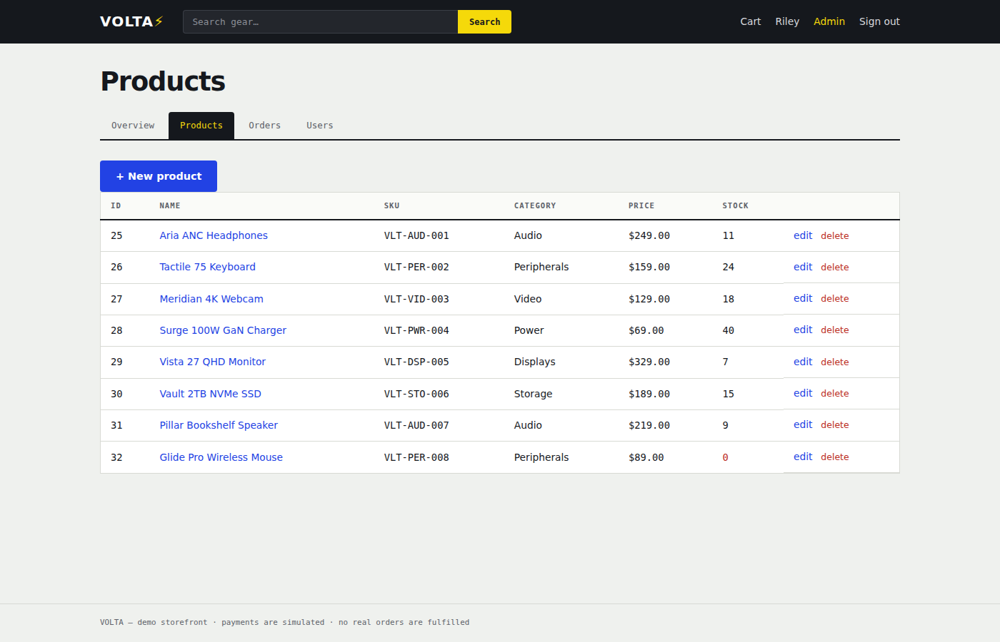

<div align="center">

# ⚡ VOLTA

### A full-featured e-commerce platform. Zero JavaScript frameworks. One dependency.

Product catalog · reviews & ratings · cart · checkout · order tracking · full admin panel — all in server-rendered Flask with SQLite, tested end-to-end with a real browser.


</div>

---



## 📋 Table of Contents

- [Features](#-features)
- [Screenshots](#-screenshots)
- [Quick Start](#-quick-start)
- [Demo Accounts](#-demo-accounts)
- [Architecture](#-architecture)
- [Project Structure](#-project-structure)
- [Route Map](#-route-map)
- [Testing](#-testing)
- [Design Notes](#-design-notes)
- [Production Checklist](#-production-checklist)
- [Roadmap](#-roadmap)
- [License](#-license)

---

## ✨ Features

### Storefront
- **Product catalog** with live search, category filters, and pagination
- **Product pages** with ratings, stock status, quantity selection, and customer reviews
- **Reviews & ratings** — one review per customer per product, enforced at the database level
- **Session cart** with quantity updates, stock-aware limits, and a live count badge
- **Multi-step checkout** — shipping form, order summary with itemized totals, free shipping over $100, tax calculation
- **Order tracking** — placed → paid → delivered lifecycle with timestamps
- **Demo payment gateway** — one click to simulate payment (drop-in point for Stripe/PayPal)

### Accounts
- **Registration & sign-in** with salted password hashing (Werkzeug/PBKDF2)
- **Profile page** with editable name/password and full order history

### Admin panel
- **Dashboard** — revenue, order/product/user counts, low-stock alerts, recent orders
- **Product management** — create, edit, delete with validation
- **Order fulfilment** — mark paid orders as delivered
- **User directory** with per-user order counts
- **Access control** — admin routes are decorator-protected

### Engineering
- **One dependency.** Flask. Database is stdlib `sqlite3`, auth is Werkzeug (ships with Flask), images are generated SVGs — the store runs fully offline
- **Money as integer cents** everywhere — no floating-point currency bugs
- **Stock integrity** — checkout decrements stock atomically in a single transaction; carts clamp to available stock
- **Real E2E tests** — a Playwright script drives an actual browser through the entire customer and admin journey

## 📸 Screenshots

*Every screenshot below was captured from the running app by the automated E2E test.*

| Product page | Cart |
|---|---|
|  |  |

| Checkout | Order tracking |
|---|---|
|  |  |

| Admin dashboard | Admin product management |
|---|---|
|  |  |

## 🚀 Quick Start

```bash
git clone https://github.com/pritichaudhariii/Volta.git
cd Volta

python -m venv .venv
source .venv/bin/activate        # Windows: .venv\Scripts\activate
pip install -r requirements.txt

python -m app.seed               # create + seed the database
python run.py                    # → http://localhost:5000
```

That's the whole setup. No database server, no Node, no build step, no API keys.

## 👤 Demo Accounts

| Role | Email | Password |
|---|---|---|
| Admin | `admin@volta.dev` | `admin123` |
| Customer | `jordan@example.com` | `password123` |
| Customer | `priya@example.com` | `password123` |

## 🏗 Architecture

```
Browser ──► Flask (3 blueprints)
              │
              ├── shop.py   catalog · product · cart · checkout · orders
              ├── auth.py   register · login · profile
              └── admin.py  dashboard · product CRUD · fulfilment · users
              │
              ├── Jinja2 templates (server-rendered, zero JS frameworks)
              └── db.py ──► SQLite (stdlib sqlite3)
                              users · products · reviews · orders · order_items
```

Key decisions:

- **Server-rendered HTML** — every page is a template render; forms POST and redirect. Simple, fast, SEO-friendly, and trivially debuggable.
- **Blueprints as module boundaries** — shop, auth, and admin are independent; each imports only the tiny `db` helper layer.
- **`query()` / `execute()` helpers** return plain dicts, so route code reads like SQL with none of an ORM's ceremony.
- **Checkout is one transaction** — order insert, item inserts, and stock decrements commit together or not at all.
- **Product art is generated SVG** — the seed script draws duotone illustrations per product, so the demo needs no image hosting and works with no internet connection.

## 📂 Project Structure

```
Volta/
├── app/
│   ├── __init__.py        # app factory, auth decorators, template filters
│   ├── db.py              # SQLite schema + query helpers
│   ├── shop.py            # catalog, cart, checkout, orders
│   ├── auth.py            # register, login, profile
│   ├── admin.py           # dashboard, product CRUD, fulfilment
│   ├── seed.py            # demo data + SVG product art generator
│   ├── templates/         # Jinja2 (base, home, product, cart, checkout, admin/…)
│   └── static/            # style.css + generated product images
├── e2e.py                 # Playwright browser test of the full journey
├── 01-home.png … 07-admin-products.png   # screenshots (captured by the E2E test)
├── run.py                 # dev entry point
└── requirements.txt       # Flask. That's it.
```

## 🗺 Route Map

| Route | Method | Purpose |
|---|---|---|
| `/` | GET | Catalog with `?q=`, `?category=`, `?page=` |
| `/product/<slug>` | GET | Product detail + reviews |
| `/product/<slug>/review` | POST | Add a review *(auth)* |
| `/cart` · `/cart/add/<id>` · `/cart/update/<id>` | GET/POST | Cart management |
| `/checkout` | GET/POST | Shipping + place order *(auth)* |
| `/orders/<id>` · `/orders/<id>/pay` | GET/POST | Order detail + demo payment *(auth)* |
| `/register` · `/login` · `/logout` · `/profile` | GET/POST | Accounts |
| `/admin/` | GET | Dashboard *(admin)* |
| `/admin/products` (+ `/new`, `/<id>/edit`, `/<id>/delete`) | GET/POST | Product CRUD *(admin)* |
| `/admin/orders` · `/admin/orders/<id>/deliver` | GET/POST | Fulfilment *(admin)* |
| `/admin/users` | GET | User directory *(admin)* |

## 🧪 Testing

The E2E suite launches the app on a test port, drives a headless Chromium browser through **twelve checks** covering the complete flow — browsing, search, sign-in, cart, checkout, payment, review posting, stock decrement verification, admin dashboard, order fulfilment, and access control:

```bash
pip install playwright
playwright install chromium

python -m app.seed      # clean slate
python e2e.py
```

```
✓ home renders 8 product cards
✓ search filters the catalog
✓ product page shows seeded reviews
✓ customer sign-in
✓ cart holds 2 items
✓ checkout creates an order
✓ demo payment marks order paid
✓ review posting
✓ stock decrements after purchase
✓ admin dashboard
✓ admin can fulfil orders
✓ admin routes protected

ALL E2E CHECKS PASSED ✅
```

## 🎨 Design Notes

The UI is a custom "equipment catalog" design system — porcelain background, ink nav, cobalt actions, and a volt-yellow accent. Two signature details:

- **Spec-plate card footers** — each product card ends in an equipment-label plate carrying the SKU, price, and a **five-segment charge bar** showing stock level at a glance
- **Status stamps** — orders carry PLACED / PAID / DELIVERED badges through the whole lifecycle, from customer order pages to the admin queue

Everything uses system font stacks (no webfont requests), respects `prefers-reduced-motion`, and keeps visible keyboard focus states.

## 🔒 Production Checklist

This is a portfolio/demo app. Before real traffic you would:

- [ ] Set a strong `SECRET_KEY` environment variable (session signing)
- [ ] Replace the demo gateway with Stripe or PayPal + webhooks
- [ ] Add CSRF tokens to forms (e.g. Flask-WTF)
- [ ] Serve behind a real WSGI server (gunicorn/uwsgi) + HTTPS
- [ ] Add rate limiting on auth endpoints
- [ ] Swap SQLite for Postgres if you expect concurrent writers

## 🗺 Roadmap

- [ ] Product image upload in the admin panel
- [ ] Wishlist / save-for-later
- [ ] Email receipts (SMTP)
- [ ] Sales chart on the admin dashboard
- [ ] Discount codes
- [ ] Stripe integration behind a `PAYMENT_PROVIDER` flag

## 📄 License

MIT — use it, fork it, ship it.

---

<div align="center">

**Built with Flask, SQLite, and a volt of enthusiasm ⚡**

</div>
